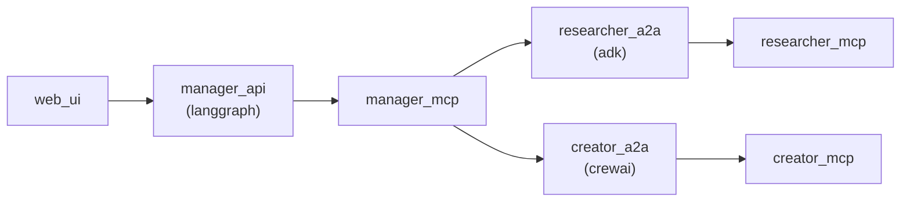

# AI Agent

[Demo](https://web-e9wb.onrender.com/)

Description: A multi-agent AI chatbot application capable of searching online and creating images.

Technologies: Streamlit, FastAPI, LangGraph, crewAI, ADK, A2A, MCP

## Architecture



## Run locally

### docker-compose

```
docker-compose up
```

### pipenv

```
pipenv install
pipenv shell
streamlit run web.py --server.address=0.0.0.0 --server.port=8501
uvicorn manager_server:app --reload --host 0.0.0.0 --port 80
python3 manager_mcp.py --host 0.0.0.0 --port 8080
python3 researcher_server.py --host 0.0.0.0 --port 10000
python3 researcher_mcp.py --host 0.0.0.0 --port 8000
python3 creator_server.py --host 0.0.0.0 --port 10001
python3 creator_mcp.py --host 0.0.0.0 --port 8001
```

## Observability

[Render](https://dashboard.render.com/project/prj-d1gk24bipnbc73ar1o3g)

[LangSmith](https://smith.langchain.com/o/e872addb-ceec-459d-935e-194aff2fe189/projects/p/07c2696a-9fa5-40a8-926c-de887cfbd75d?timeModel=%7B%22duration%22%3A%227d%22%7D&mode=graph)

[Supabase](https://supabase.com/dashboard/project/loslvkaxzpgxxgsagfuj/storage/buckets/llm)
