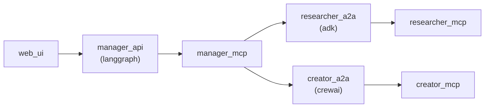

# AI Agent

Description: A multi-agent AI chatbot application capable of searching online and creating images.

Technologies: Streamlit, FastAPI, LangGraph, crewAI, ADK, A2A, MCP

## Run locally

```
pipenv install
pipenv shell
streamlit run web.py --server.address=0.0.0.0 --server.port=8501
uvicorn manager_server:app --reload --host 0.0.0.0 --port 80
python3 manager_mcp.py --host 0.0.0.0 --port 8080
python3 researcher_server.py --host 0.0.0.0 --port 10000
python3 researcher_mcp.py --host 0.0.0.0 --port 8000
python3 creator_server.py --host 0.0.0.0 --port 10001
python3 creator_mcp.py --host 0.0.0.0 --port 8001
```

## Architecture


